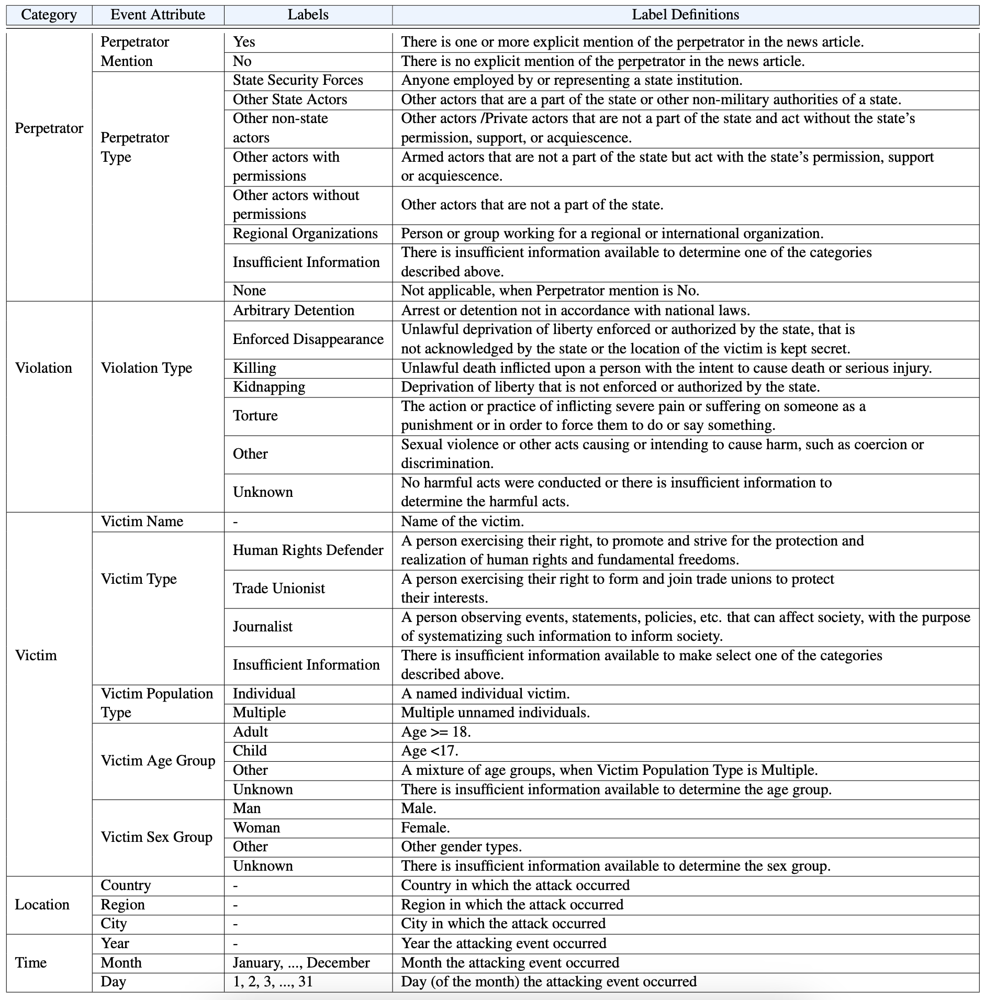
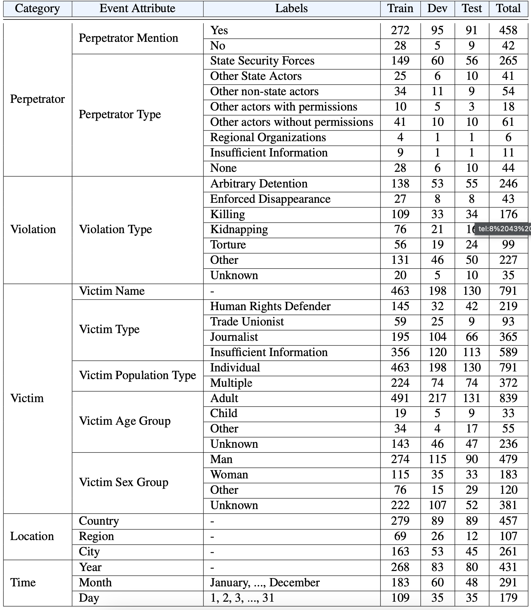
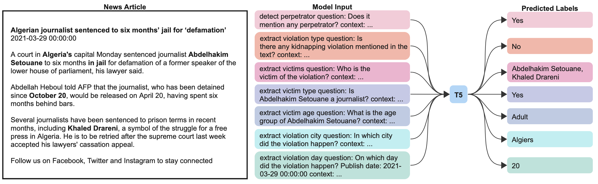
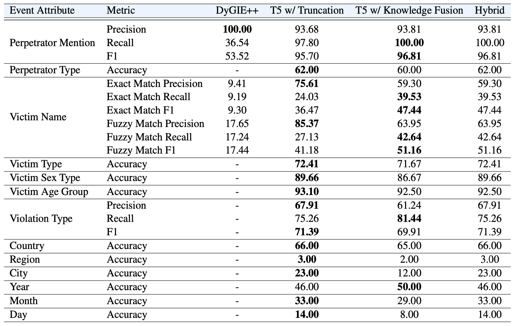

# A New Task and Dataset on Detecting Attacks on Human Rights Defenders
This repo contains dataset proposed in our paper [A New Task and Dataset on Detecting Attacks on Human Rights Defenders](PlaceholderLink), along with the code to train and evaluate the proposed baseline models.


## Dataset

### Labeling Ontology
The table below shows the complete labeling ontology of our proposed dataset HRDsAttack.


### Label Statistics
The table below shows the label distributions of our proposed dataset HRDsAttack.


## Data Structure
All samples in the dataset are news articles with annotated attributes regarding attacking events to Human-Right Defenders (or similar populations). Each field in the JSON files and its corresponding descriptions are listed in the table below:

|Name|Description|Example|
|---|---|---|
|sample|A dictionary containing input information||
|sample.HIT_id|A string representing the HIT ID generated by AMT for this particular sample| '3PCPFX4U425BGL7W2W0L3431269QFN'|
|sample.Input.GLOBALEVENTID|An integer representing the unique ID inherited from GDELT database|907181142|
|sample.Input.article_interface|Formatted string of the news article to be displayed in the annotation UI|'<p>ISTANBUL</p> <p>Seven people were arrested in Istanbul over aiding ex-Nisan CEO Carlos Ghosn’s escape from Japan to Lebanon, according to security sources on Thursday.</p> ... <p>No further details of the suspects have been provided.</p>'|
|sample.Input.title|A string representing the title of the news article|'Anna Tuckett looks at the importance of the BBC and local journalism'|
|sample.Input.batch_idx|An integer indicating the index of the batch this sample was included in|1|
|sample.Input.publish_date|A string representing the publish date of the news article|'2020-02-20 05:00:00'|
|annotations|A list of dictionaries. Each dictionary contains an `annotation` object and additional worker information||
|annotation|A dictionary with all event attributes as keys, and labels as values|{'city': 'San Francisco','country': 'United States of America', 'date': '25', 'month': 'April', 'perpetrator_mention': True, 'perpetrator_type': 'other actors without permissions',...}|
|work_time_in_seconds|An integer representing how many seconds the worker spent to complete this annotation|658|
|worker_id|A string representing the (*anonymized*) ID of the worker who annotated this sample|'785a674a-5d15-4023-a6f6-60e336cfbb63'|
|annotation.city|A string representing the city-level geo of the event|'San Francisco'|
|annotation.region|A string representing the region-level geo of the event|'California'|
|annotation.country|A string representing the country-level geo of the event|'United States of America'|
|annotation.date|A string indicating the date when the event happened|'02'|
|annotation.month|A string indicating the month when the event happened|'April'|
|annotation.year|A string indicating the year when the event happened|'2021'|
|annotation.perpetrator_mention|A boolean value indicating if any perpetrator is mentioned in the news article|True/False|
|annotation.perpetrator_type|A string indicating the type of the perpetrator|'state actor'|
|annotation.violation_types|A list of strings indicating all the types of violations associated to the event|['arbitrary detention', 'killing', 'other']|
|annotation.victims|A list of dictionary, each dictionary is all attributes associated to single victim||
|victim_idx|An integer indicating the index of the victim|1|
|victim_name|A string representing the name of the victim|'Alexander Shabarchin'|
|victim_type|A list of strings indicating the types of the victim|['human rights defender', 'journalist']|
|victim_keywords|A string of keywords for this particular victim|'Poland, musician, Catholicism, free speech'|
|victim_population_type|A string indicating if the victim is a named individual or a group of unnamed individuals|'individual'|
|victim_sex_type|A string representing the sex of the victim|'male'|
|victim_age_group|A string representing the age group of the victim|'adult'|


## Modeling
The figure below shows the overall framework of our proposed baseline model:


### Requirements
Install the dependencies:

- `python3.8+`
- `pip3 install -r requirements.txt`

Download the Spacy English model:
```
python -m spacy download en_core_web_sm
```

### Training
All of the experiments were conducted on a single AWS g5.xlarge	machine, which is based on a NVIDIA A10G GPU. To train the model on different machines, the batch size should be modified to fit the GPU memory size.
```
python src/models/few_shot_t5.py \
       --train_file data/train.json \
       --dev_file data/dev.json \
       --test_file data/dev.json \
       --lr 4e-5 \
       --lr_decay 1e-5 \
       --epoch 20 \
       --batch_size 4 \
       --eval_per_epoch 3 \
       --gpu 0 \
       --gradient_accumulation_steps 16 \
       --model_name t5-large-prefix-average-metric \
       --dataset_name v1.0 \
       --eval_metric average \
       --add_prefix \
       --use_metric \
       --replicate
```
### Evaluation
For evaluation with paragraph-based fusion for all classes
```
python src/models/evaluate.py \
       --model_dir ./pretrained_model \
       --output_dir tmp/t5_un \
       --add_prefix \
       --fusion
```
- `--model_dir` is the directory that contains the model checkpoint
- `--output_dir` is the directory to save the visualization results

For evaluation without paragraph-based fusion
```
python src/models/evaluate.py \
       --model_dir ./pretrained_model \
       --output_dir tmp/t5_un \
       --add_prefix
```

For evaluation with hybrid model
```
python src/models/evaluate.py \
       --model_dir ./pretrained_model \
       --output_dir tmp/t5_un \
       --add_prefix \
       --fusion \
       --hybrid
```

To replicate the reported evaluation results on Human Rights Defenders dev set with paragraph-based fusion
```
python src/models/evaluate.py \
       --model_dir ./pretrained_model \
       --output_dir tmp/t5_un \
       --add_prefix \
       --fusion \
       --replicate
```

### Results
The table below shows the overall performance of the baseline models on HRDsAttack test set (%) (All experiments are based on a single run with a preset random seed).



## Citation:
If you find our dataset or code in this repo helpful, please cite [our paper](PlaceholderLink):
```bibtex
placeholder

```
